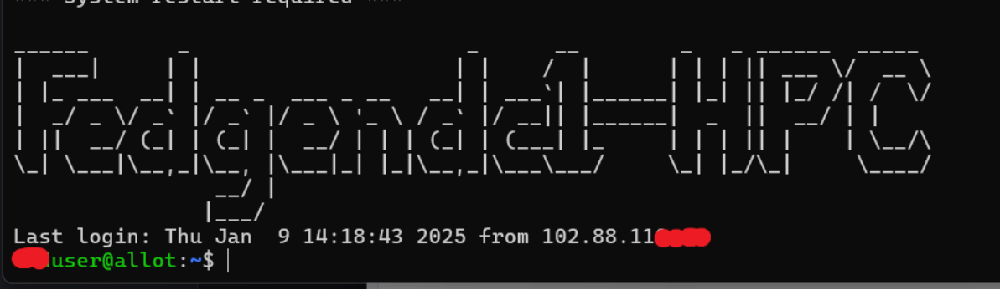
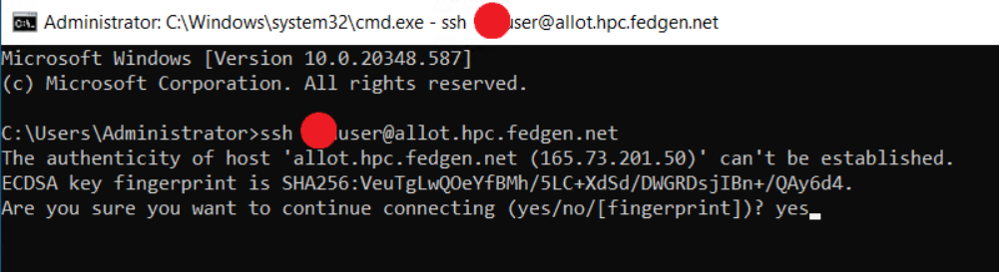
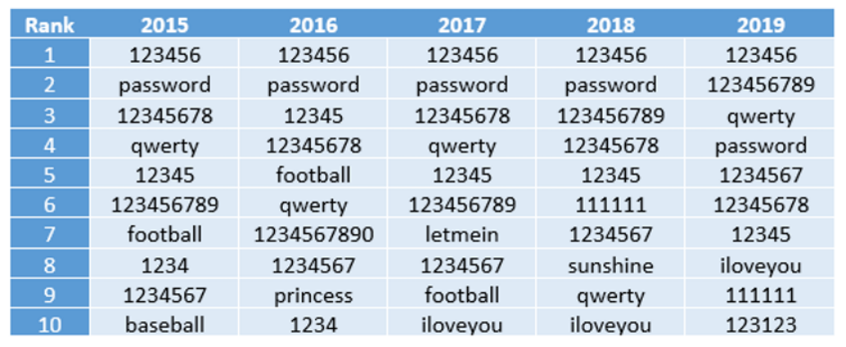

Working With An SSH Client
---------------------------

Modern Operating (Microsoft Windows, Apple MacOS and Linux) Systems
already have ssh client inbuilt; however there are other ssh
applications with added features that offers better experience.

**Windows**

Microsoft Windows does offer ssh which is accessible through Powershell
or the CMD.
Users have the alternative of `putty <https://www.putty.org/>`__ and
`MobaXterm <https://mobaxterm.mobatek.net/>`__.

**Linux**

Linux offers a command line terminal by default

**MacOS**

MacOS includes a built-in terminal window, there's nothing to install.
Just open the terminal app and type your SSH command. The default
terminal app doesn't offer many bells and whistles but it gets the job
done.

For Robust Terminal experience, Alternatives include
`Termius <https://termius.com/>`__ and `iTerm2 <https://iterm2.com/>`__

Connect to the login node from your terminal:
=============================================

Type the following on the command-line

..codeblock::

      $ssh username@allot.hpc.fedgen.net

First time login users will be prompted to change their password.
Passwords must adhere to standard complexity requirements.

The more complex the password, the more robust it is against brute
force. see **password section** below

If everything worked properly, you should be greeted by a message
similar to

|FedgenDC1-Welcome|

**Note**

      Upon your very first connection to each FEDGEN HPC Cluster, you will be
      greeted by a warning such as:

|Authenticity|

This warning is normal, the SSH program warns that it is the first time
it sees this computer. To make sure you are actually connecting to the
right machine, you should compare the `RSA key
fingerprint <https://en.wikipedia.org/wiki/Public_key_fingerprint>`__ shown
in the message with the fingerprint shown in the picture above. The
fingerprint can be based on hash function MD5 or SHA-256.

If they match, you are safe to proceed and enter **yes**. That hostname
key will be stored and used to check in every subsquent SSH connection
that the server is indeed always the same.

Using Secured Passwords
===========================

|image1|

*Fig. 1 *\ Time to brute force a password in 2023 as a function of
length and complexity. Credit: Hive Systems with data sourced
from `https://www.hivesystems.io <https://www.hivesystems.io/>`__

**Exemple of hacked passwords**

+----------------------------------+-----------------+-----------------+
| mt8CIe0Qhh                       | eisenach!       | 123avier123     |
+----------------------------------+-----------------+-----------------+
| avier123a12345678910             | Kraz2kriz       | alaska2.        |
+----------------------------------+-----------------+-----------------+
| 12345678910                      | 04DI32609       | ag.53yf         |
+----------------------------------+-----------------+-----------------+
| Kraz2kriz                        | firebird14      | 04IE69422       |
+----------------------------------+-----------------+-----------------+

|image2|

*Fig. 2 *\ The 2019 annual SplashData password survey revealed the most
common passwords from 2015 to 2019.

.. |image1| image:: media/Working_With_An_SSH_Client2145.png

