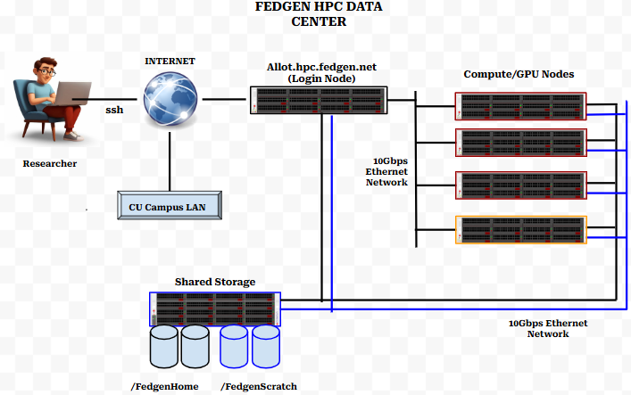

FEDGEN HPC Layout
--------------------

The FEDGEN HPC comprises of five different kinds of nodes: the login
node, the compute nodes, the accelerator nodes, the management nodes and the storage nodes. In a typical
workflow, users primarily access FEDGEN HPC by connecting to the login
node, where they compile and test code before submitting jobs to
the `SLURM
queue <../job_scheduling/SLURM%20Workload%20ManagerMAIN.rst>`__
which automatically assigns a compute node(s) to the submitted job. This
HPC layout is in the diagram below.

|FEDGEN HPC Flow|

Login Node
===========
The Login node is the only node directly accessible over the internet.
Users connect to the login from their personal computers/workstation using `ssh <https://hpcdocs.fedgen.net/en/latest/access/Working%20With%20An%20SSH%20Client.html>`_ before accessing other parts of the FEDGEN HPC Cluster. Users initiate their jobs primarily from the login node.

Compute Nodes
===============
Compute nodes perform the actual computations submitted to the cluster.
They are often organised into groupings called **partitions**.
A typical compute node has one, two, or four **processor sockets** on the
motherboard to host a `Central Processing Unit (CPU) <https://en.wikipedia.org/wiki/Central_processing_unit>`__. Modern Processors are made of
multiple Physical **cores**, that can be thought of as independent processing units, some of which can possess a feature to further handle two threads (see `multi-threading <https://en.wikipedia.org/wiki/Multithreading_(computer_architecture)>`__) simultaneously.

Accelerator Nodes
=================
These are special purpose compute nodes equipped with Graphics Processing Units (GPU) for computation
intesive tasks. The GPU usually offloads certain computations off the CPU for tasks not ideal for it.
ideal 

Storage Nodes
==============
Dedicated nodes for cluster Storage shared filesystem across the entire cluster

Management Nodes
================
these computers run the management services like Slurm, but also the user directory, the monitoring and
reporting applications, etc. ;

